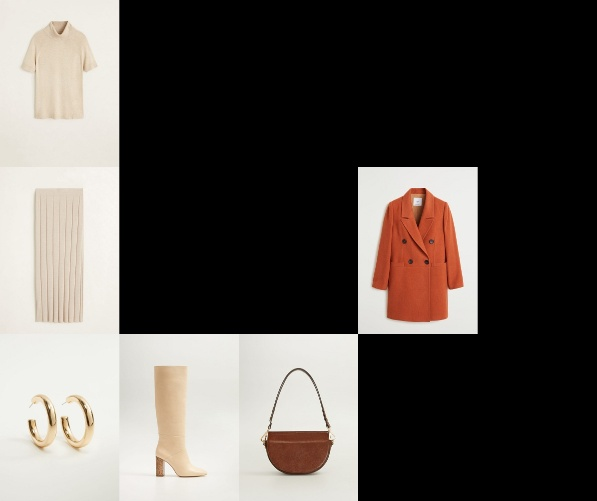

# UPC Datathon 2023 - Fashion Compatibility Challenge

## Overview
In the Fashion Compatibility Challenge, participants are tasked with creating a model that can generate compatible outfit recommendations from a given initial product. Fashion matching is a nuanced task, often going beyond metadata to include intricate patterns and visual details that contribute to the compatibility of clothing items.

The challenge focuses on the complementary aspects of fashion items to form aesthetically pleasing ensembles. A specific task, "Fill in the Blank," involves predicting a missing item from a set of candidate products to complete an outfit. This task is a crucial step toward the broader goal of creating entire outfits based on single product inputs. We encourage participants to explore various innovative approaches to tackle the challenge.

Participants will handle real outfits curated by stylists and fashion experts from MANGO, showcasing their skills in software development within a competitive environment and under tight deadlines.

## Getting Started

### Prerequisites
Before running the code, ensure that you have the following prerequisites installed:
- Python 3.x
- OpenCV library
- NumPy library
- TensorFlow library (if using machine learning models)

Install the required Python packages:
pip install -r requirements.txt

### Installation
Clone the repository to your local machine:
git clone https://github.com/PauMayench/datathon-FME-2023-fashion-compatibility-X2PJ.git

Navigate to the project directory:
cd datathon-FME-2023-fashion-compatibility-X2PJ

### Usage
To generate outfits and save them to the designated class directories, run:
python outfit_generator.py

## Data Structure
The dataset consists of images categorized into different classes. The 'class1' directory contains images of 'good' outfits, while 'class2' houses 'bad' outfits generated with certain constraints.

## Model Training
The provided Python script reads image data, preprocesses it, and fits it to a convolutional neural network model. The model is then saved and evaluated against a test set.

## Acknowledgments
- Thanks to MANGO for providing the expertly curated outfit data.

