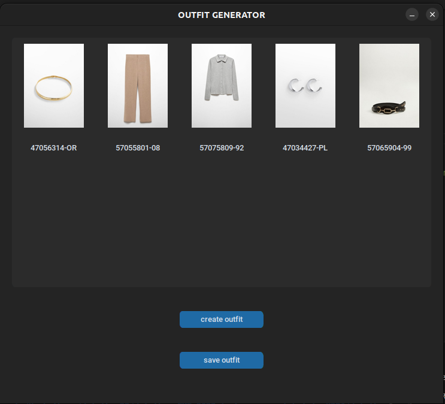

# UPC Datathon 2023 - Fashion Compatibility Challenge

## Overview
In the Fashion Compatibility Challenge, participants are tasked with creating a model that can generate outfits with compatible fashion products.
We adopted a convolutional neural network approach, where given some outfits on the format of images and metadata we create an image like this, and feed the model with it to train it. 

===================================================

This model is able to tell, given an outfit, the degree of compatibility between the fashon products 

Then we implemented a gui where you can generate outfits, each time you press the button "generate outfit" it creates 20 random outfits, each of them is given to the trained model and it returns the respective compatibility, if the best one is over a certain threshold we show it to the user, if not, we call the function again.

## Getting Started

### Prerequisites
Before running the code, ensure that you have the following prerequisites installed:
- Python 3.x
- OpenCV library
- NumPy library
- TensorFlow library
- Customtkinter library
- Pillow Library

### Installation
Clone the repository to your local machine:
`git clone https://github.com/PauMayench/datathon-FME-2023-fashion-compatibility-X2PJ.git`

Navigate to the project directory:
`cd datathon-FME-2023-fashion-compatibility-X2PJ`

Install the required Python packages:
`pip install -r requirements.txt`

### Usage
First of all move to the datathon directory with:
`cd datathon`
unzip the folder inside datathon images.zip with:
`unzip datathon/images.zip -d datathon/`

Now you can execute the gui with:
`python3 gui.py`

You can train the model by following the steps:

To generate the training samples run:
`python3 MakeNeuralNetworkInput.py`
>[!NOTE]
>It can take a little long

To train the model on the generated data simply run:
`python3 NeuralNetworkTraining.py`
>[!WARNING]
>You have to have some free RAM on your laptop on the moment of execution, on our tests we needed at least 12G, if your training fails you can go inside the code and change the variable MAX_SAMPLES to smaller values like 4000 or 2000, the model will be trained with less data

## Data Structure
The dataset consists of images categorized into different classes. The 'class1' directory contains images of 'good' outfits, while 'class2' houses random outfits generated with certain constraints.

## Model Training
The provided Python script reads image data, preprocesses it, and fits it to a convolutional neural network model. The model is then saved and evaluated against a test set. 

## IMPROVEMENTS

As of the last update, the model does not receive most of the products' metadata in its input, and so it does not have access to potentially important data.

The two types of outfits that the model is trained to differentiate between are good outfits (given by the MANGO dataset) and almost random outfits, made by ourselves. The problem is that, by chance, some of the random outfits could actually be good, messing up the training. Instead, the model should be trained to differentiate between good outfits and bad outfits, but we couldn't find a way to generate 100% bad outfits to use as training input.

## Acknowledgments
- Thanks to MANGO for providing the expertly curated outfit data.

